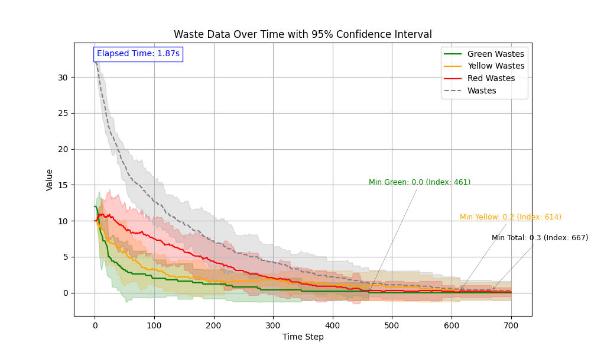

# Utilisation

Commandes pour utiliser notre projet :
Dans un premier temps, télécharger les requirements (principalement mesa qui diffère d'un projet habituel)

```
pip install requirements.txt
```

## Solara

Pour utiliser notre projet sur Solara en visualisation :

```
cd robot_mission_13

solara run server.py
```

## Batch runs

Pour run par batch, voir les courbes dans robot_mission_13/data/wastes et les csv dans robot_mission_13/data/model_runs

```
cd robot_mission_13

python run_strat.py
```

Il est possible de modifier directement dans le code les paramètres de config pour les runs.
*run_and_save()* run une config unique avec une batch_size et en ressort une courbe du nombre de déchets moyens restants par steps (et par type de déchets)
*run_model_results()* run un batch de config (une fois par config) et en sort un csv *results_{timestamp}* avec la config et le nombre de steps avant convergence.

# Stratégies sans communication

## Random

Ici, les robots se baladent aléatoirement tant qu'ils n'ont pas deux déchets de leur zone ou un déchet supérieur. Sauf pour les rouges, qui vont se déplacer aléatoirement sauf dès qu'ils ont un déchet de leur zone.

Afin de garantir la convergence et que tous les déchets soient fusionnés et ne restent pas sur deux robots verts différents par exemple, on rajoute un **taux de drop de 5%** lorsque l'agent jaune ou vert porte un déchet de sa zone.

Lorsque l'agent porte un déchet supérieur, il se dirige sur la frontière de sa zone avec la zone supérieure (avec Rouge > Orange > Vert)

## Fusion And Research

### Description des comportements des agents (stratégies sans communication)

Les comportements des agents sont organisés par couleur d’équipe, chaque équipe disposant de **deux types d’agents** : des *chercheurs* et un *chef*. Voici une description détaillée de leur fonctionnement :

---

### Agents Verts

- **Chercheurs**  
  - Chaque chercheur commence dans sa zone dédiée. Leur mouvement suit un motif systématique :
    - Ils partent soit du bas vers le haut, soit du haut vers le bas (alternance définie à l'initialisation).
    - Ils balayent ensuite leur zone ligne par ligne, de droite à gauche puis de gauche à droite, en montant ou en descendant.
  - Lorsqu’un chercheur trouve un déchet vert, il le ramène immédiatement à la frontière.
  - Si un autre déchet se trouve sur son chemin, il le fusionne avec le premier avant de déposer le nouveau déchet.

- **Chef**  
  - Le chef reste sur la **frontière** de la zone verte.
  - Il effectue des allers-retours sur cette colonne pour **fusionner les déchets verts** déposés par les chercheurs.

---

### Agents Oranges

- **Chercheurs**  
  - Le fonctionnement est similaire à celui des chercheurs verts.
  - Leur zone de recherche inclut toutefois **la zone orange ainsi que la frontière verte**, ce qui fait que la recherche des déchets fusionnés par les verts n'est pas la plus efficace.

- **Chef**  
  - Identique au chef vert, il reste sur la **frontière de la zone orange** et fusionne les déchets apportés par les chercheurs.

---

### Agents Rouges

- **Chercheurs**  
  - Ils couvrent **toute la zone rouge ainsi que la frontière orange**, selon le même motif de déplacement que les autres équipes.
  - Lorsqu’ils trouvent un déchet rouge, ils ne retournent pas à la frontière, mais se dirigent vers **la dernière colonne** pour y localiser une poubelle et y déposer le déchet.

- **Chef**  
  - Contrairement aux autres chefs, le chef rouge ne reste que sur la **frontière orange**, où il cherche les déchets rouges fusionnés.

*Figure 1: Schéma de fonctionnement de notre mode Fusion and Research*


### Nombre de steps avant complétion pour les stratégies sans communication

*Tableau 1: Tableau du nombre de steps avant de ne plus avoir aucun déchets*


*Figure 2: Courbe des déchets au fil des steps en moyenne pour 12 / 10 / 10 déchets et 3 / 3 / 3 agents avec le mode Fusion and Research.*  


*Figure 3: Courbe des déchets au fil des steps en moyenne pour 12 / 10 / 10 déchets et 3 / 3 / 3 agents avec le mode Random.*  


### Observations

La méthode Fusion and Research est bien plus efficace que la random dans tous les cas. On observe envrion en moyenne deux fois moins de steps pour les cas conséquents.

# Stratégies avec communication

## Fusion And Research With Communication

### Description des comportements des agents (stratégies sans communication)

Tout d'abord, les agents se comportent dans un premier temps de la même manière que Fusion And Research. Ensuite, la communication intervient pour :

- **Les chercheurs** : Lorsque deux chercheurs TOP et DOWN se rencontrent sur la même ligne, toute la map de leur couleur a forcément été fouillé. Ils s'envoient alors un message pour bien voir si ils sont bien deux agents différents TOP & DOWN. Si oui, ils envoient à tous les agents de la zone que la zone est clean et qu'ils peuvent se déplacer sur la frontière de la zone inférieure pour venir récupérer les déchets fusionnés.
  
- **Les chefs** : Rien ne change à part pour le chef rouge qui désormais agit comme les autres chefs et ne reste pas sur la frontière orange, mais sur la zone de la poubelle, et est le seul à déposer dans la poubelle les déchets.

### Observations

*Tableau 2: Tableau du nombre de steps avant de ne plus avoir aucun déchets pour le mode avec communication*


Observations :
Si on compare au mode sans communication, c'est au niveau des grands nombre de déchets qu'on voit une grande différence de steps (36 green waste voire 48). Avec moins, pas encore d'intérêt. On se propose alors de faire un nouveau tableau de comparaison avec une map deux fois plus large et longue (40 en longueur et 20 en hauteur) :
*Tableau 2: Tableau du nombre de steps avant de ne plus avoir aucun déchets sur map doublée avec seulement 3 agents de chaque*


Bilan : La communication est plutôt efficace sur les grandes maps et avec beaucoup de déchets. En revanche, elle ne change pas grand chose sur les petites maps et peu de déchets.
On pourrait aller plus loin en rajoutant de la communication des chercheurs vers les chefs pour dire lorsqu'ils déposent un déchet et où.

*Figure 4: Courbe des déchets au fil des steps en moyenne pour 20 / 10 / 10 déchets et 3 / 3 / 3 agents pour une grande map avec le mode Fusion and Research With Communication en haut et sans communication en bas.*  


